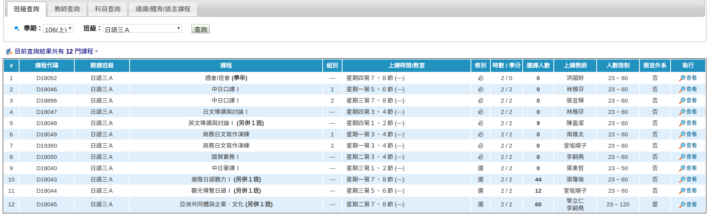

# Scrapy課程爬蟲教學

請先參考前一篇的[scrapy教學](scrapy.md)

### 安裝環境

`pip install scrapy requests simplejson pyprind selenium bs4`

### 流程

1. 爬查詢系統首頁，得到系所和年級的清單
2. 分析該學校是用何種方式送請求，通常都是把`系所代號等等`放在`querystring`用`get`方式傳出去；另外一種就是用`post`把`系所代號`送出去
3. 把所有系所的request都送一遍然後爬回來
4. 透過`Scrapy`的`item`自動形成團隊要的`Schema`

### 中科大的scrapy示範

完整程式碼在此，請大家搭配服用：[超連結](https://github.com/Stufinite/CampassCrawler/blob/master/UCrawler/UCrawler/spiders/NUTC.py)

1. 建立該學校的spiders：
    1. `scrapy genspider 學校名稱（NUTC） 網域（aisap.nutc.edu.tw）`

1. 編輯`spiders/NUTC.py`，import團隊定義好的item
    ```
    from UCrawler.items import UcrawlerItem
    ```

    欄位的意義：
    ```
    department 開課系所
  	for_dept 給哪個系所上的課
  	grade 年級
  	title 課程名稱
  	time 時間
  	credits 學分
  	obligatory_tf 必修或選修
  	professor 教授
  	location 地點
  	code 課程代碼
  	note 備註
  	campus 校區
    ```

    1. `class variable`部份：
        1. `start_urls`填入課程查詢的網址：
        `start_urls = ['https://aisap.nutc.edu.tw/public/day/course_list.aspx']`
        2. class variable可以放一些翻譯對對照table，例如中文的星期轉成數字：
        ```
        day_table = {
              '一':1,
              '二':2,
              '三':3,
              '四':4,
              '五':5,
              '六':6,
              '日':7,
          }
        ```

        建立一份課程類別的清單。api會以此清單做課程的分類  
        類別固定這三種:`通識類, 體育類, 其他類`  
        此變數定義在spider的class variable裏面  
        [參考中科大的scrapy範例](UCrawler/Ucrawler/spiders/NUTC.py)  
        ```
        genra = {
            '通識':'通識類',
            '體育類':'體育類',
            '語言':'其他類',
            'xxxx':'通識類',
            'yyyy':'體育類',
            'zzzz師培':'其他類',
            'zzzz軍訓':'其他類',
            ...
        }
        ```

    2. `start_requests`部份：
        start_requests的角色是回傳所有scrapy將要去拜訪的網址  
        在爬課程網站時，所有將拜訪的網址  
        就是所有系所的組合  

        `start_requests`統一建立一個 `dept_table`  
        裏面包含系所名稱和系所代碼的對照表  
        每間學校對於不同年級可能有不同的系所代碼  
        以下用`中科`和`中山`做示範
        ```
        {
          "企管一乙": "1120170202",
          "企管一甲": "1120170201",
          "企管一１": "1420170191",
          "企管三乙": "1120150202",
        }
        or
        {
          "中學學程": "AB0A",
          "中文系": "B101",
          "企管系": "B401",
          "光電系": "B309",
          "劇藝系": "B106",
          "化學系": "B202",
          "國語文": "AC1C",
          "外文系": "B102",
          "工學院": "B30A",
          ...
        }
        ```

        以及 `latest_semester`變數，用來存放最新的學年字串  
        ex：`1061`

        再來就是骨幹的for loop  
        使用前面定義好的`dept_table`以及`latest_semester`去依序拜訪  
        每個request都傳到`self.parse`去做進一步處理
        ```
        for code in pyprind.prog_bar(dept_table.values()):
                yield scrapy.Request('https://aisap.nutc.edu.tw/public/day/course_list.aspx?sem={}&clsno={}'.format(latest_semester, code), self.parse)
        ```
    3. `parse`部份：
      大部分的查詢結果如下：
        
      都會有多門課程在同一個網頁  
      所以必須要用for loop  
      把每一行（也就是每一門課程）  
      弄成一個item物件再yield  
      實作上分成`3`個步驟：
          1. schema：每間學校他們table的欄位都不一樣  
          請先用soup選取，並且取名成`schema`
          2. dataList：將每一門課程，都用`dict(zip(schema,  課程))`的方式，整理成一個像這樣的陣列：
              ```
              [
                {
                  'campus': 'NSYSU',
                  'code': 'CM498',
                  'credits': 3.0,
                  'department': '管理學院',
                  'for_dept': '管理學院',
                  'grade': '0',
                  'location': '管CM 4112',
                  'note': '《講授類》\xa0※英語授課',
                  'obligatory_tf': False,
                  'professor': '張姮燕',
                  'time': [{'day': 1, 'time': ['6', '7', '8']}],
                  'title': '跨文化管理CROSS-CULTURE MANAGEMENT'
                },
                ...
                ...
                ...
              ]
              ```
          3. 用一個for loop，迭代`dataList`，把每個`dict`轉成`item`物件然後`yield`：
              ```
              for data in dataList:
                  courseItem = UcrawlerItem()
                  courseItem['code'] = data['課程代碼']
                  courseItem['note'] = data['組別']
                  courseItem['campus'] = 'NUTC'

                  # 省略多個item欄位
                  ...

                  yield courseItem
              ```
3. 執行：`scrapy crawl NCTU -o NCTU.json -t json`就能夠得到中科的課程爬蟲了，其他學校如法炮製。
4. 完整程式碼：[超連結](https://github.com/Stufinite/CampassCrawler/blob/master/UCrawler/UCrawler/spiders/NUTC.py)
